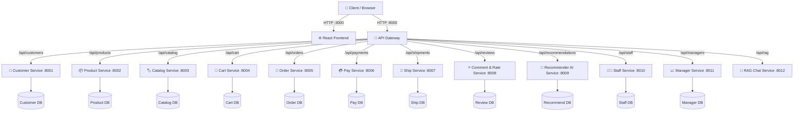

# 📚 Microservice BookStore


Hệ thống BookStore toàn diện được xây dựng theo kiến trúc **Microservices (Microservice Architecture)**. Dự án sử dụng API Gateway đóng vai trò Entrypoint, mỗi dịch vụ đều có cơ sở dữ liệu riêng biệt độc lập và toàn bộ hệ thống được triển khai tự động hóa bằng Docker Compose.

---

## 🏗️ 1. Tổng quan Kiến trúc (Architecture)

Hệ thống bao gồm ứng dụng Client (Frontend web UI), một API Gateway và 12 Backend Microservices thực hiện chức năng chuyên biệt.



---

## 🚀 2. Danh sách Các Dịch vụ (Services)

### 🌍 Services Công khai
| Service | Host Port | Công nghệ | Mô tả |
|---------|---------|-----------------|-------|
| `frontend` | `3000` | React + Vite | Giao diện tương tác với người dùng (UI), được serve qua Nginx trong container |
| `api-gateway` | `8000` | Django DRF | Entrypoint duy nhất định tuyến toàn bộ request HTTP tới các services backend |

### 🔒 Backend Microservices (Internal)
Mỗi service (ngoại trừ `rag-service`) đều liên kết độc quyền với một CSDL PostgreSQL.

| Service | Vai trò & Chức năng (Role) | Database Container |
|---------|------------------|----------|
| `customer-service` | Quản lý khách hàng, đăng nhập, phân quyền | `customer-db` |
| `product-service` | Quản lý thông tin Sách & Tồn kho | `product-db` |
| `catalog-service` | Quản lý Cây danh mục (Categories) | `catalog-db` |
| `cart-service` | Quản lý Giỏ hàng của người dùng | `cart-db` |
| `order-service` | Điều phối Checkout tĩnh, tương tác với Pay/Ship/Cart | `order-db` |
| `pay-service` | Xử lý giao dịch thanh toán & hóa đơn (Mock) | `pay-db` |
| `ship-service` | Quản lý vận chuyển & Mã tracking theo dõi | `ship-db` |
| `comment-rate-service` | Nhận xét, đánh giá sản phẩm | `comment-rate-db` |
| `recommender-ai-service`| Đề xuất SP (AI Collaborative Filtering) | `recommender-db` |
| `staff-service` | Quản lý Nhân sự & Phân quyền nội bộ | `staff-db` |
| `manager-service` | Báo cáo doanh thu, Thống kê Quản trị | `manager-db` |
| `rag-service` | RAG Chatbot (Sử dụng LLM) tìm hiểu sách | Không dùng CSDL riêng |

---

## ⚙️ 3. Tương tác Nghiệp vụ Chính (Orchestration & Choreography)

- **Chu trình Đặt hàng (Checkout):**
  `order-service` lấy Data từ `cart-service` ➔ Khởi tạo Thanh toán `pay-service` ➔ Khởi tạo Vận chuyển `ship-service` ➔ Xóa dữ liệu trong `cart-service`.
- **Hệ thống Gợi ý (Recommendation):**
  `recommender-ai-service` sử dụng lịch sử mua hàng từ `order-service` ➔ Tính toán gợi ý bằng User-Based Collaborative Filtering (kết hợp tín hiệu rating) hoặc theo độ phổ biến (Popularity Fallback) nếu là User mới.
- **RAG Chat Assistant:** 
  Từ Client qua `api-gateway` (`/api/rag/chat`) ➔ Gọi LLM Model thông qua Google API sinh câu trả lời.

---

## 🏃 4. Hướng dẫn Khởi chạy (Quick Start)

### Yêu cầu tiên quyết:
- **Docker Engine & Docker Compose (v2)** hỗ trợ tối đa việc build ảo hoá.
- *(Tùy chọn)* Python 3.10+ để sử dụng script tạo Seed data trên host.

### Khởi chạy toàn bộ hệ thống:
1. Clone / Mở Terminal tại thư mục gốc của project.
2. Build và khởi động 24 containers (12 Services + 11 Databases + Gateway) bằng lệnh sau:
```bash
docker compose up --build -d
```
Trạng thái ban đầu có thể tốn một lúc để tải images, cài đặt thư viện (`pip install`) và khởi tạo CSDL PostgreSQL.

**Các địa chỉ quan trọng:**
- **Frontend App:** [http://localhost:3000](http://localhost:3000)
- **API Gateway:** [http://localhost:8000](http://localhost:8000)
- **Kiểm tra Health:** [http://localhost:8000/health/](http://localhost:8000/health/)

### Dừng hệ thống:
```bash
# Chỉ tắt container:
docker compose down

# Xóa toàn bộ Data (Database Volumes):
docker compose down -v
```

---

## 🌱 5. Seed Dữ Liệu (Tạo Dữ Liệu Mẫu)

Script seed sẽ giúp bạn tạo sẵn categories, thông tin sản phẩm mẫu (dựa vào `books_data.csv`), tài khoản Khách hàng / Nhân sự.
Tại thư mục gốc, gõ lệnh:
```bash
python scripts/seed_data.py
```
*(Chi tiết về Seed script tại `scripts/README.md`)*

---

## 📡 6. Cấu trúc API Endpoints (Thông qua Gateway)

Mọi request Web/Mobile gọi tới hệ thống thông qua Entrypoint duy nhất trên cổng `8000`:
`http://localhost:8000/api/<resource-prefix>/<path>`

<details>
<summary><b>Click để xem danh sách Nhóm API chính</b></summary>

| Tiền tố đường dẫn (Prefix) | Trỏ đến Service | Yêu cầu xác thực |
|--------|---------------|------------------|
| `/api/customers/...` | `customer-service` | Login/Profile/Register |
| `/api/products/...` | `product-service` | Public - Get/List |
| `/api/catalog/...` | `catalog-service` | Public |
| `/api/cart/...` | `cart-service` | Thường kết hợp Customer ID |
| `/api/orders/...` | `order-service` | Sinh đơn checkout |
| `/api/payments/...` | `pay-service` | - |
| `/api/shipments/...` | `ship-service` | - |
| `/api/reviews/...` | `comment-rate-service` | Cần xác thực Customer |
| `/api/recommendations/...`| `recommender-ai-service`| Lấy theo Customer ID |
| `/api/staff/...` | `staff-service` | User đăng nhập Staff |
| `/api/managers/...` | `manager-service` | User đăng nhập Manager |
| `/api/rag/chat` | `rag-service` | Endpoint Post chat JSON |

</details>

---

## 📁 7. Cấu trúc Thư mục (Directory Structure)

```text
microservice-bookstore/
├── 🐳 docker-compose.yml       # Định nghĩa tập trung các Config Server
├── 🐳 docker-compose.override.yml
├── 🌍 frontend/                # React App Source
├── 🚪 api-gateway/             # Config Gateway định tuyến 
├── 📦 product-service/         # App quản trị Sản phẩm (Django)
├── 👤 customer-service/        # App quản trị Auth Khách (Django)
├── 🤖 recommender-ai-service/  # Source Engine ML/Collaborative Filter
├── ... (Các Microservices Back-end khác tương tự)
└── 📜 scripts/                 # Công cụ CLI (Seed data, Setup)
```

---

## 🔧 8. Biến Môi trường và TroubleShooting

### Môi trường
Các file config chủ yếu được nhúng Environment Variable trong `docker-compose.yml`.
> *Lưu ý: Đối với `rag-service`, hãy đảm bảo nhập biến `GOOGLE_API_KEY` của bạn thì Frontend Chatbot mới hoạt động chính xác.*

### Xử lý sự cố thường gặp (Troubleshoot)
- **Lỗi `503 Service Unavailable / Gateway Timeout`:** Gateway đã chạy xong nhưng các services con phía sau chưa kịp Start/Healthy. Hãy check tiến trình qua `docker compose ps` và đợi khoảng 1-2 phút rồi refresh lại app.
- **Frontend gọi API bị lỗi CORS:** Đảm bảo trên cổng `3000`, `axios`/`fetch` URL được chỉ định gọi vào `http://localhost:8000`.
- **Database Migration Error:** Nếu thay đổi DB Models dẫn tới xung đột DB state, hãy gỡ sạch volumes bằng lệnh `docker compose down -v` và chạy lại.

---

## ✅ 9. Production Checklist (Giai đoạn Triển khai mở rộng)

- [ ] Tắt Flag `DEBUG=False` mặc định của Django trong môi trường triển khai thực tế.
- [ ] Bảo vệ endpoints giao tiếp dạng *Service-to-Service*. Hiện tại đang sử dụng các API Internal gọi trên HTTP thông thường.
- [ ] Implement Caching phân tán (Redis).
- [ ] Sử dụng Event-Driven/Message Broker (RabbitMQ hoặc Kafka) cho luồng tương tác Đơn hàng thay vì gọi API đồng bộ.
- [ ] Thiết lập Monitoring với ELK Stack và Distributed Tracing.

**Tác giả / Duy trì:** Dự án Booking/E-Commerce Microservices.
